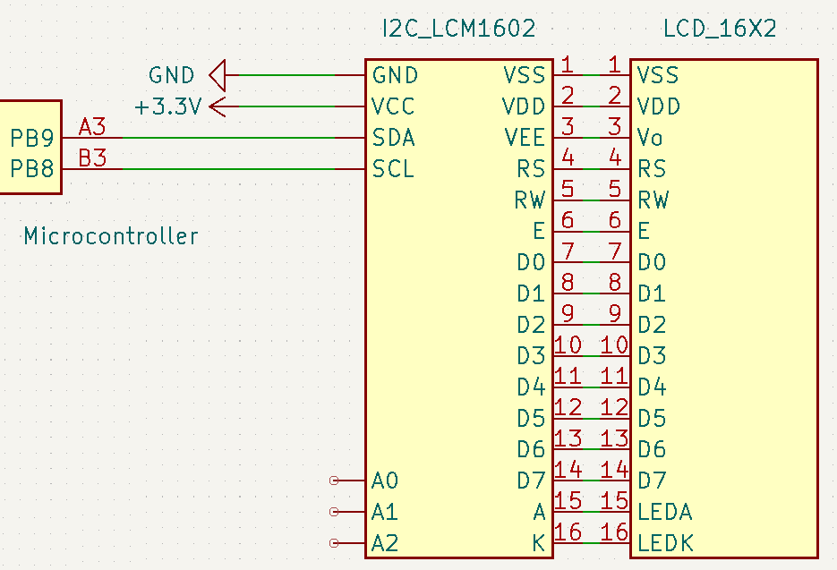

# Systemy Wbudowane - Projekt Grupy Laboratoryjnej 04

Realizacja projektu polega na zaprojektowaniu urządzenia embedded (systemu wbudowanego) do pomiaru temperatury. Projekt urządzenia w teorii mógłby stanowić podstawę do konstrukcji fizycznego prototypu urządzenia. Zakres projektu obejmuje dobór komponentów, mając na uwadzę:

- kompatybilność
- cenę
- rozmiary
- dostępność
- przystępność komponentu (tj. dostępność dokumentacji i schematów pozwalających na integrację komponentu)

W projekcie przedstawiono także schemat elektryczny potencjalnego urządzenia obrazujący połączenia komponentów przy zastosowaniu odpowiednich interfejsów.

## Skład grupy

- Imię Nazwisko (ta sekcja zostanie uzupełniona przed wysyłką projektu aby nie przechowywać danych uczestników w publicznym repozytorium)

## Specyfikacja urządzenia

Projektowane urządzenie stanowi kompaktowe i przystępne cenowo rozwiązanie do monitorowania temperatory przy pomocy termopary, z odczytem w czasie rzeczywistym lokalnie i zdalnie oraz zapisem na zewnętrznym nośniku. Urządzenie oparte jest o mikroprocesor: [STM32L151QDH6](https://www.mouser.pl/ProductDetail/STMicroelectronics/STM32L151QDH6?qs=pmcUWs1B1IIEPym5rr0MIA%3D%3D)

## Funkcjonalności

- Pomiar temperatury (przy pomocy termopary)
- Wyświetlanie warotści temperatury na alfanumerycznym wyświetlaczu **LCD** w czasie rzeczywistym
- Zapis pomiarów na karcie **micro SD**
- Możliwość odczytu aktualnej wartości i wartości zapisanych przez łączność **Bluetooth**
- Ustawienie alarmu, tj. wartości temperatury której przekroczenie (poniżej lub powyżej - w zależności od wybranego trybu) powoduje emisje sygnału dźwiękowego oraz powiadomienia w przypadku łączności **Bluetooth**

### Pomiar temperatury

W urządzeniu do pomiaru temperatury wykorzystywane są termopary typu K. Do interpretowania oraz przekształcania wyników pomiaru termopar wykorzystywane są dodatkowo konwertery **MAX31855KASA**.

#### Termopara

Poniżej przedstawiona jest częściowa charakterystyka wykorzystywanej termopary tpu K:

<p align="center">

| Zakres temperatur  | Precyzja pomiaru | Zakres napięcia wyjściowego |
| :----------------: | :--------------: | :-------------------------: |
| od -100°C do 500°C |       ±2°C       |      od -6mV do +20mV       |

</p>

#### Konwerter

Poniżej przedstawiona jest częściowa charakterystyka wykorzystywanego konwertera **MAX31855KASA**:

<p align="center">

| Zakres temperatury pracy | Rozdzielczość mierzonej temperatury |
| :----------------------: | :---------------------------------: |
|    od -40°C do 125°C     |               0.25°C                |

</p>

Precyzja pomiaru a mierzona temperatura:

<p align="center">

| Mierzona temperatura | Temperatura pracy  | Precyzja pomiaru |
| :------------------: | :----------------: | :--------------: |
| od -200°C do +700°C  | od -20°C do +85°C  |       ±2°C       |
| od +700°C do +1350°C | od -20°C do +85°C  |       ±4°C       |
| od -270°C do +1372°C | od -40°C do +125°C |       ±6°C       |

</p>

#### Funkcjonalność

Pomiar temperatury odbywa się za pomocą termopar typu K. Typ K został wybrany z uwagi na dużą uniwersalność, niszki koszt i powszechność. Dodatkowo typ K oferuje odpowiednio szeroki zakres temperatury pomiaru. By ułatwić interpretacje wyników pomiaru termopary, wykorzystywane są konwertery **MAX31855KASA**, które przekształcają napięcie wyjściowe termopar na wartość temperatury w trywialnym do odczytania sygnale cyfrowym, niewymagającym dodatkowych przekształceń lub obliczeń. Sygnał cyfrowy z konwerterów jest następnie przesyłany przez SPI do mostka SC18IS606, z którego do mikrokontrolera przesyłany jest po I²C.

#### Schemat podłączenia konwertera i termopary

<p align="center">

</p>

### Monitoring pomiaru w czasie rzeczywistym na alfanumerycznym ekranie LCD

#### Funkcjonalność

W urządzeniu do wyświetlania aktualnych wyników pomiarów wybraliśmy [LCD 2x16 wraz z konwerterem I²C LCM1602](https://botland.com.pl/wyswietlacze-alfanumeryczne-i-graficzne/2351-wyswietlacz-lcd-2x16-znakow-niebieski-konwerter-i2c-lcm1602-5904422309244.html). Możemy sterować zarówno wyświetlanym tekstem jak i podświetleniem, włączając lub wyłączając je w dowolnej chwili.  

#### Interfejs

Mikrokontroler, jako master w magistrali I2C, wysyła komendy i dane do konwertera I²C, który przetwarza je i przesyła do wyświetlacza LCD. To pozwala na komunikację między mikrokontrolerem, a wyświetlaczem za pomocą tylko dwóch linii SDA i SCL, zamiast wielu linii zwykłego interfejsu.

#### Schemat podłączenia konwertera i wyświetlacza

<p align="center">

</p>

Warto też zauważyć, że w naszym konwerterze znajdują się niewykorzystane zworki do zmiany adresu. Z racji, iż mamy tylko jedno jedno urządzenie nie musimy zmieniać adresu.

### Zapisywanie szeregu czasowego pomiarów na karcie Micro SD

Mikroprocesor **STM32L151QDH6** obsługuje funkcjonalność **SDIO** czyli natywną obsługę kart **SD** i **micro SD**.

#### Karta

Urządzenie korzysta z [karty SD](https://www.mouser.pl/ProductDetail/SanDisk/SDSDAF3-008G-I?qs=1mbolxNpo8fZAfuISob5lQ%3D%3D&fbclid=IwAR3uOF-8bRSwpAjd_N-QHTMrXoeQ3epMvccDN1hPOX3yTVwqzyb5hUU9yYw) umieszczonej wewnątrz [gniazda](https://www.mouser.pl/ProductDetail/Amphenol-Commercial-Products/GSD090012SEU?qs=tRxQeHRxj%252BXvWoySYux1gA%3D%3D&fbclid=IwAR05BEZquKpICgIlDTuL0jnoq6x6cgd6fhGVbJ8ECmOt5Kil7ea-M47Jce8). Karta z serii **Industrial** cechuje się dobrymi parametrami przesyłu jak i parametrami związanymi z wytrzymałością na warunki pracy (według [dokumentacji](https://www.mouser.pl/datasheet/2/669/SanDisk_02052018_SDSDAF3_SDSDQAF3-1285144.pdf)).

<p align="center">

| Wielkość pamięci | Maksymalna prędkość odczytu - zapisu | Zakres napięcia wejściowego |
| :----------------: | :--------------: | :-------------------------: |
| 8 GB |     80 MB/s - 50 MB/s   |     2.7 V - 3.6 V      |

</p>

#### Funkcjonalność

Urządzenie wykorzystuje czterobitowy tryb przesyłu (alternatywą był tryb jednobitowy), co wymagało zastosowania trzech dodatkowych linii danych, ale pozwala na osiągnięcie większej przepustowości komunikacji, co w związku z możliwością rozszerzenia urządzenia o dodatkowy moduł zwiększający maksymalną ilość podłączonych termopar jest uzasadnione.

Zgodnie z [artykułem](https://controllerstech.com/interface-sd-card-with-sdio-in-stm32/?fbclid=IwAR2p-ghQLy9oqxvOHQ20ZAalOFvRGLVjqF9gRw9ewYPpdKlW8OFwY_Fl_N8) przy prawidłowym podłączeniu, obsługa zapisu i odczytu sprowadza się do odpowiedniej konfiguracji w trakcie pisania oprogramowania dla urządzenia.

Sposób zapisu danych na karcie polega na tworzeniu oddzielnego pliku dla każdej z termopar (nazewnictwo odpowiadające numerowi termopary) i umieszczania danych według ustalonego formatu, np.

```text
[YYYY-MM-DD-HH-mm-SS-miliseconds]<VALUE>
```

albo:

```text
[<miliseconds_since_epoch>]<VALUE>
```

urządzenie dysponowałoby kilkoma formatami zapisu, co możnaby zmieniać (np. poprzez zastosowanie zworek - mikroprocesor dysponuje dużą liczą niezagospodarowanych pinów, albo poprzez zaimplementowanie menu sterowanego przyciskami)

### Komunikacja przy pomocy interfejsu Bluetooth

#### Funkcjonalność

Komunikacja przy użyciu **Blueetooth** pozwala na odczyt danych w czasie rzeczywistym, oraz przegląd danych zapisanych na **karcie SD**. Takie rozwiązanie wymaga stworzenia dedykowanej aplikacji dla urządzenia.

#### Interfejs

Do komunikacji Bluetooth użyty został moduł **BMD-330** firmy [uBlox](https://www.u-blox.com/en/). Jest to komponent dostępny w sieci dostawcy [Mouser Electronics](https://www.mouser.pl/), cechujący się zadowalającym stosunkiem ceny do oferowanych parametrów.

Pozwala na komunikację w standardzie **Bluetooth 5.0** z uzyskaniem mocy wyjściowej na poziomie: **4 dBm** umożliwiając komunikację z prędkością do **2 Mb/s**. Urządzenie należy do klasy **Bluetooth Low Energy** pobierając nie więcej niż **12 mA** (dla napięcia zasilania z przedziału **1.7 V - 3.6 V**).

<p align="center">
  
</p>

Moduł **BMD-330** jest stosunkowo złożonym urządzeniem zawierającym własny mikroprocesor, wbudowaną antenę i wiele komponentów pozwalających na wykorzystanie go na wiele sposobów. W naszym przypadku będziemy komunikować się z modułem przy użyciu magistrali **I2C**.

<p align="center">
  
</p>

Zestawienie pinów modułu jest również bardzo obszerne, dlatego ze względu na przejrzystość schematu, stworzyliśmy własny model urządzenia zawierający jedynie używane przez nas linie, czyli zasilanie i linie interfejsu **I2C**.

### Emisja sygnałów dźwiękowych po przekroczeniu zadanej wartości progowej temperatury

#### Moduł buzzera

Do zrealizowania funkcjonalności użyto [modułu buzzera](https://botland.com.pl/buzzery-generatory-dzwieku/2963-modul-z-buzzerem-pasywnym-bez-generatora-czarny-5904422359263.html?cd=18298825651&ad=&kd=&gclid=CjwKCAiA76-dBhByEiwAA0_s9bgiyegkOrxPVHvjLPdCjIwSULFG82rgwxfOtnJEmOHJ_1PyzE-WoBoCAmwQAvD_BwE) bez generatora od firmy **Iduino**.

Moduł zasilany jest napięciem **5V**, a pobór prądu nie przekracza **30mA**. Moduł generuje sygnał przy podaniu stanu wysokiego na pin **S**.

#### Funkcjonalność

Zgodnie z [instrukcją](https://arduinomodules.info/ky-006-passive-buzzer-module/?fbclid=IwAR2xrSQEQvXJQoSaBCyPUAT1Qpdzo6-RQKKRTS8gIRmnc9uBtt7pPz5gDqI) urządzenie będzie pozwalało na generowanie sygnałów dźwiękowych o różnej wysokośći dzięki modulacji **PWM**.

Regulacji progu wyzwolenia alarmu oraz trybu działania tj. wyzwalanie przy zejściu poniżej zadanej temperatury albo po wyjściu ponad zadaną temperaturę jak i całkowitego wyłączenia alarmu dla danej termopary dokonujemy poprzez przyciski (tact switch'e) połączone z wejściami cyfrowymi mikroprocesora. Z racji na możliwość konfiguracji wbudowanych rezystorów pull-up albo pull-down na schemacie elektrycznym pominięto rezystory.

## Potencjalna konfiguracja

### **SDIO**

Wybrany mikroprocesor [STM32L151QDH6](https://www.mouser.pl/ProductDetail/STMicroelectronics/STM32L151QDH6?qs=pmcUWs1B1IIEPym5rr0MIA%3D%3D) obsługuje 4bitową obsługę **SDIO** (natywną komunikację z nośnikami w postaci kart SD i micro SD). Prawdopodobnie tryb 1-bitowy zapewniłby wystarczającą prędkość transmisji do zapisu danych pozyskiwanych przez urządzenie, przynajmniej dla wairantu z czteroma termoparami. Ze względu na możliwość dołączania kolejnych modułów rozszerzających liczbę termopar, bezpieczniej jest skorzystać z trybu w większej przepustowości.

<p align="center">
  
</p>

### **I2C**

W przypadku konfiguracji interfejsu **I2C** można pozostawić domyślne ustawienia (tzn. nie zmniejszać prędkości zegara). Ze względu na możliwości rozszerzenia ilości używanych termopar wskazane jest zachowanie wysokiej przepustowości magistrali do przesyłu danych.

<p align="center">
  
</p>

<p align="center">
  
</p>

Z analizy dokumentacji [konwertera napięć termopary](https://github.com/Tomasz-Zdeb/Embedded-Systems-Class-Project/issues/8) (tj. modułu interpretującego napięcie w kontekście temperatury):

- <https://www.mouser.pl/new/maxim-integrated/maximmax31855/>
- <https://www.mouser.pl/pdfDocs/MAX31855.pdf>

oraz analizie materiałów dotyczących interfejsu **SPI**:

- <https://www.youtube.com/watch?v=eFKeNPJq50g&ab_channel=Digi-Key>
- <https://fastbitlab.com/nss-setting-stm32-master-slave-mode/>
- <https://www.digikey.com/en/maker/projects/getting-started-with-stm32-how-to-use-spi/09eab3dfe74c4d0391aaaa99b0a8ee17>

<p align="center">
  
</p>

stwierdzono, że w celu zapewnienia właściwej komunikacji z komponentem używającym tej magistrali konfiguracja interfejsu **SPI** polegała będzie na ustawieniu trybu:

- **Master** (Mikroprocesor-master, konwerter-slave)
- **Half-Duplex**

Ze względu na brak jednolitego standardu komunikacji **SPI** istotne są parametry **CPOL** i **CPHA** określające przebieg transmisji względem polaryzaji zegara i linii danych.

<p align="center">
  
</p>

Według dokumentacji konwertera należy przyjąć wartości:

- **CPOL** = 0
- **CPHA** = 0

Ze względu na prostotę użytkowania interfejsu **I2C** i potrzębę podłączenia większej ilości urządzeń wykorzystujących interfejs **SPI** (pomiar przy pomocy więcej niż jednej termopary) w projekcie korzystamy z [mostka I2C do SPI](https://www.mouser.pl/ProductDetail/NXP-Semiconductors/SC18IS606PWJ?qs=pBJMDPsKWf02qtdqbj2bbA%3D%3D), który pozwala na podłączenie do trzech linii (urządzeń) **SPI** (wg. [dokumentacji](https://www.mouser.pl/datasheet/2/302/SC18IS606-2933187.pdf)).

### **PWM**

Najistotniejszym elementem konfiguracji wyjścia PWM jest ustawienie źródła sygnału zegara na zegar wewnętrzny i ustawienie generowania sygnału PWM na kanale pierwszym. Pozostałe parametry można pozostawić z wartościami domyślnymi.

<p align="center">
  
</p>

W kofniguracji wykorzystywany jest wewnętrzny zegar mirkoprocesora (Zastosowanie zewnętrznego zegara byłoby w tym przypadku niczym nieuzasadnione)

<p align="center">
  
</p>

### **GPIO**

W przypadku wejść cyfrowych, konfiguracja polega na arbitralnym wyborze niezagospodarowanych pinów (których wybrany procesor posiada sporo) i ustawienia ich trybu pracy na input mode.

<p align="center">
  
</p>

### Zestawienie pinów

- **SDIO**

<p align=center>

| Sygnał | Pin  |
| :----: | :--: |
|   D0   | PC8  |
|   D1   | PC9  |
|   D2   | PC10 |
|   D3   | PC11 |
|   CK   | PC12 |
|  CMD   | PD2  |

</p>

- **I2C**

<p align=center>

| Sygnał | Pin |
| :----: | :-: |
|  SCL   | PB8 |
|  SDA   | PB9 |

</p>

- **PWM**

<p align=center>

| Sygnał | Pin |
| :----: | :-: |
|  CH1   | PA5 |

</p>

- **GPIO**

<p align = center>

| Pin  |
| :--: |
| PB12 |
| PB13 |
| PD10 |
| PD13 |
| PE15 |

</p>

## Schemat elektryczny

## Kosztorys

### Ceny jednostkowe komponentów

- moduł Bluetooth: 27,80 zł
- mikroprocesor: 39,20 zł
- buzzer: 5,90 zł
- Tact Switch (niebieski): 3,40 zł
- Tact Switch (czerwony): 3,40 zł
- Tact Switch (czarny): 2,90 zł
- gniazdo karty pamięci SD z wyrzutnikiem: 2,60 zł
- karta pamieci: 293,70 zł
- wyświetlacz LCD + konwerter: 24,70 zł
- termopara typu K: 21,47 zł
- chip do interpretowania napięć: 49,98 zł
- obudowa: 10 zł

### Sumaryczna cena komponentów urządzenia

485,05 zł

### Potencjalna cena rynkowa urządzenia

679,07 zł - przyjąłem 140% ceny komponentów aby pokryć koszty produkcji i zapewnić marżę dla wytwórcy

## Pliki źródłowe projektu

pliki źródłowe projektu wraz z odniesieniami do źródeł (znajdujących się w GitHub Issues - używanych do definiowania zadań) są dostępne w [publicznym repozytorium](https://github.com/Tomasz-Zdeb/Embedded-Systems-Class-Project)
